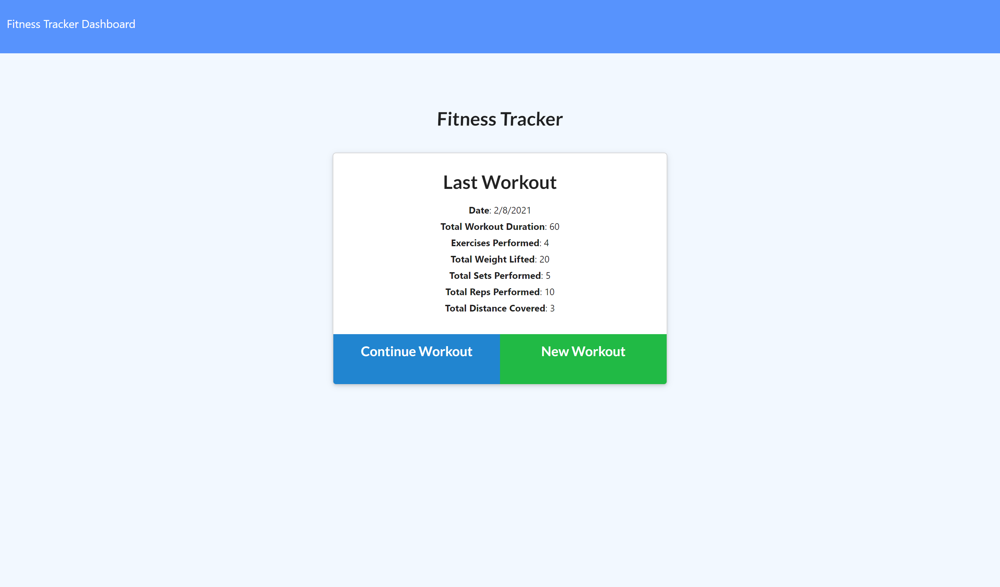
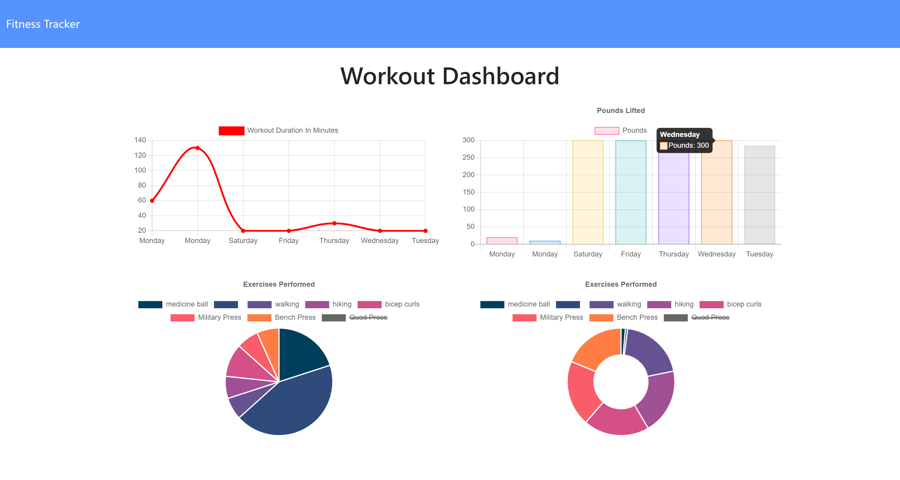

# Fitness Tracker

## Description
Fitness Tracker is designed to allow the user to enter a workout, either cardio or resistance, and record the number of minutes and reps.  The tracker will provide the totals of the last workout on the main page, and then a summary of the last seven days on the dashboard.  This assignment was designed to make use of a noSQL database, MongoDB, with the Mongoose package, then using Atlas to deploy the database on Heroku.


## Table of Contents
- [Description](#Description)
- [Installation](#Installation)
- [Usage](#Usage)
- [License](#License)
- [Contributing](#Contributing)
- [Badges](#Badges)
- [Questions](#Questions)
- [Credits](#Credits)

---

## Installation
From GitHub, fork the repo and upload all contents to the deployed server. The server must have Node.js installed. Once forked, run `npm i` from the root directory to install required dependencies.

Run the node seeders/seeds.js file to incorporate prewritten data or run with npm start and add workouts manually on the local server.

---

## Usage
Visit the [Heroku site](https://limitless-savannah-23831.herokuapp.com/) and start logging your workouts!





---

## License
This application is covered under MIT License

<details>
  <summary>
    License Text
  </summary> 

```

Copyright (c) 2021  Jacquie Gutierrez

Permission is hereby granted, free of charge, to any person obtaining a copy
of this software and associated documentation files (the "Software"), to deal
in the Software without restriction, including without limitation the rights
to use, copy, modify, merge, publish, distribute, sublicense, and/or sell
copies of the Software, and to permit persons to whom the Software is
furnished to do so, subject to the following conditions:
      
The above copyright notice and this permission notice shall be included in all
copies or substantial portions of the Software.
      
THE SOFTWARE IS PROVIDED "AS IS", WITHOUT WARRANTY OF ANY KIND, EXPRESS OR
IMPLIED, INCLUDING BUT NOT LIMITED TO THE WARRANTIES OF MERCHANTABILITY,
FITNESS FOR A PARTICULAR PURPOSE AND NONINFRINGEMENT. IN NO EVENT SHALL THE
AUTHORS OR COPYRIGHT HOLDERS BE LIABLE FOR ANY CLAIM, DAMAGES OR OTHER
LIABILITY, WHETHER IN AN ACTION OF CONTRACT, TORT OR OTHERWISE, ARISING FROM,
OUT OF OR IN CONNECTION WITH THE SOFTWARE OR THE USE OR OTHER DEALINGS IN THE
SOFTWARE.

```
</details>

---

## Contributing
Please contact the author of this application to request access to the repository as a contributor/

[Jacquie Gutierrez](https://github.com/Jacquie24)

---

## Badges
[](https://opensource.org/licenses/MIT)

---

## Questions
Please comment on the repository for this project [fitness tracker](https://github.com/Jacquie24/fitness-tracker), and I will get back to you.

---

## References
* [Mongoose](https://www.npmjs.com/package/mongoose)
* [MongoDB Atlas](https://www.mongodb.com/cloud/atlas)